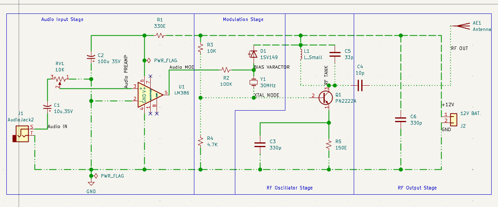
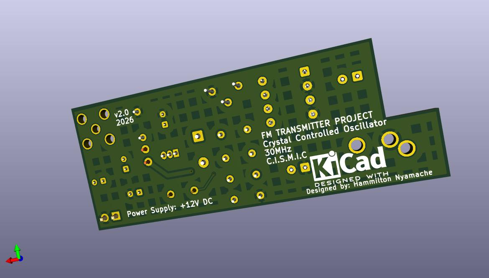
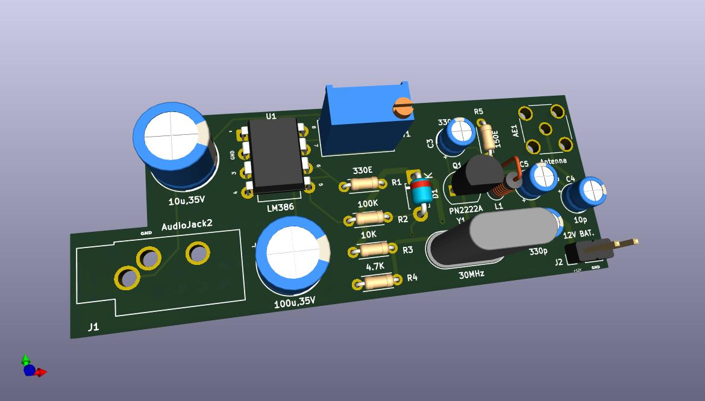

# FM Transmitter System (KiCad Project)

This repository contains the schematic and PCB design for an FM transmitter system created using KiCad.

---

## Schematic

---

## PCB 3D View

### Front View

### Back View

---

## Project Files
- KiCad schematic
- PCB layout
- Gerber manufacturing files
